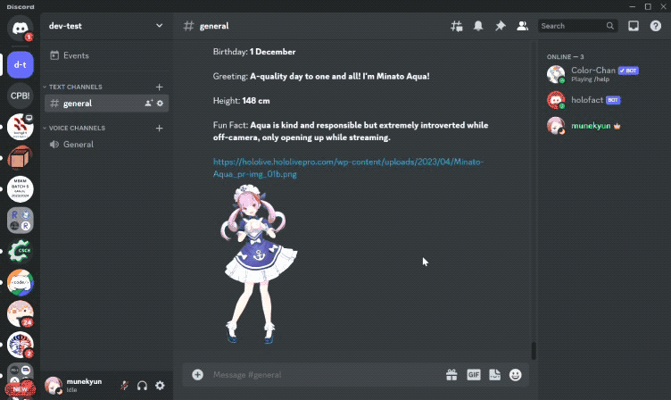

# HoloFact Discord Bot

A discord bot to gives you basic information and fun fact of certain Hololive members.

## Current Features

#### Generation:

#### Member:

#### Fact:

## Installation and Setup Instructions

### Backend

Clone the backend from https://github.com/mune-kyun/holofact, then run

`npm install`
`npm run seed`
`npm run dev`

to run it locally

### Bot

Installation:

`npm install`

To register bot commands:

`npm run register-commands`

To run locally:

`npm run dev`

## Misc

- Stacks:
  - **Bot**: discord-js, graphql-request (graphql client)
  - **Backend**: apollo (graphql server), mongoose
